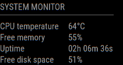

# MMM-SystemMonitor

This is a module for the [MagicMirror²](https://github.com/MichMich/MagicMirror/).



This module will display your current system stats.

## Installation

In your terminal, go to your MagicMirror's Module folder:

```bash
cd ~/MagicMirror/modules
```

Clone this repository:

```bash
git clone https://github.com/btastic/MMM-SystemMonitor
```

## Using the module

To use this module, add the following configuration block to the modules array in the `config/config.js` file:
```js
var config = {
    modules: [
        {
            module: 'MMM-SystemMonitor',
            position: 'top_left',
            config: {
                updateInterval: 60000,
                cpuThermalZone: 0,
                units: config.units,
            }
        }
    ]
}
```

## Supported hardware
- Raspberry Pi 3 (tested)
- Probably works on other Raspberry Pi's

## CPU Thermal Zone
To determine which thermal zone to use, you can check out the following command and their results:

`cat /sys/class/thermal/thermal_zone*/type`

This will output the different thermal zone your hardware has. On my raspberry pi, it will output

`cpu-thermal`

This means that index 0 is the correct thermal zone. If you have more than one result, you have to take the 0-based index accordingly.

`cat /sys/class/thermal/thermal_zone0/temp`

will output the current temperature. This is what this module will use to display the temperature.

## Configuration options

| Option               | Description
|--------------------- |-----------
| `updateInterval`     | *Optional* <br>The time interval between UI updates.<br><br>**Type:** `int`(milliseconds)<br>**Default:** 60000 milliseconds (60 seconds)
| `cpuThermalZone`      | *Optional* <br>Use the cpu thermal zone index. <br><br>**Type:** `int` <br>**Default:** 0
| `units`  | *Optional* <br>Use either 'metric' or 'imperial' to display the temperature.<br><br>**Type:** `string (metric\|imperial)` <br>**Default:** Inherit from config.js

## Available localizations
- English (en)
- German (de)